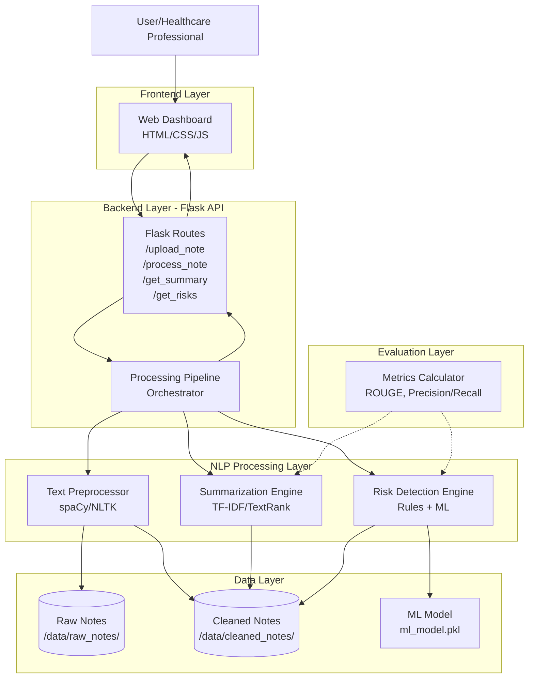
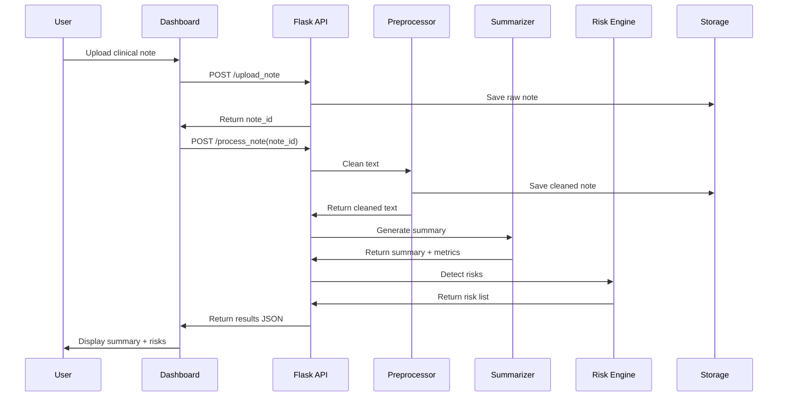

# Design Document: Clinical Notes Summarization & Risk Flagging System

## Overview

The Clinical Notes Summarization & Risk Flagging System is a Flask-based web application that processes clinical notes through a multi-stage NLP pipeline. The system architecture follows a modular design with clear separation between data processing, ML/NLP components, and presentation layers.

The core workflow consists of:
1. **Upload**: User submits clinical note via web interface
2. **Preprocessing**: Text cleaning, normalization, and tokenization
3. **Summarization**: Extractive NLP to generate 5-7 sentence summaries
4. **Risk Detection**: Rule-based and ML classification to identify health risks
5. **Display**: Results presented in dashboard with disclaimers

The system emphasizes responsible AI practices by operating exclusively on synthetic or de-identified data, providing confidence scores, and clearly stating its limitations as a non-diagnostic educational tool.

## Architecture

### High-Level Architecture



### Component Interaction Flow



## Components and Interfaces

### 1. Data Layer

#### 1.1 File Storage Structure

```
clinical_ai/
├── data/
│   ├── raw_notes/          # Original uploaded notes
│   │   └── {note_id}.txt
│   ├── cleaned_notes/      # Preprocessed notes
│   │   └── {note_id}_clean.txt
│   └── synthetic/          # Synthetic data generator output
│       └── generated_notes.json
```

#### 1.2 Note Storage Interface

```python
class NoteStorage:
    """Handles persistence of clinical notes"""
    
    def save_raw_note(note_id: str, content: str) -> bool:
        """
        Save raw clinical note to disk
        
        Args:
            note_id: Unique identifier for the note
            content: Raw note text
            
        Returns:
            True if successful, False otherwise
        """
        pass
    
    def save_cleaned_note(note_id: str, content: str) -> bool:
        """Save preprocessed note to disk"""
        pass
    
    def load_raw_note(note_id: str) -> str:
        """Load raw note by ID"""
        pass
    
    def load_cleaned_note(note_id: str) -> str:
        """Load cleaned note by ID"""
        pass
    
    def note_exists(note_id: str) -> bool:
        """Check if note exists in storage"""
        pass
```

### 2. Text Preprocessing Layer

#### 2.1 Preprocessor Component

The preprocessor uses spaCy and NLTK to clean and normalize clinical text.

```python
class TextPreprocessor:
    """Cleans and normalizes clinical notes"""
    
    def __init__(self):
        self.nlp = spacy.load("en_core_web_sm")
        self.stopwords = set(stopwords.words('english'))
        self.medical_terms = self._load_medical_dictionary()
    
    def preprocess(text: str) -> PreprocessedText:
        """
        Full preprocessing pipeline
        
        Args:
            text: Raw clinical note text
            
        Returns:
            PreprocessedText object with cleaned text and metadata
        """
        pass
    
    def lowercase(text: str) -> str:
        """Convert text to lowercase"""
        pass
    
    def tokenize(text: str) -> List[str]:
        """Tokenize into words and sentences"""
        pass
    
    def remove_stopwords(tokens: List[str]) -> List[str]:
        """Remove common English stopwords"""
        pass
    
    def lemmatize(tokens: List[str]) -> List[str]:
        """Reduce words to base forms"""
        pass
    
    def normalize_medical_terms(tokens: List[str]) -> List[str]:
        """Standardize medical terminology"""
        pass
```

#### 2.2 PreprocessedText Data Model

```python
@dataclass
class PreprocessedText:
    """Container for preprocessed text and metadata"""
    original_text: str
    cleaned_text: str
    tokens: List[str]
    sentences: List[str]
    word_count: int
    sentence_count: int
    processing_time: float
```

### 3. Summarization Engine

#### 3.1 Summarizer Interface

The summarizer uses extractive NLP techniques to generate concise summaries.

```python
class Summarizer:
    """Generates extractive summaries of clinical notes"""
    
    def __init__(self, method: str = "textrank"):
        """
        Initialize summarizer
        
        Args:
            method: "textrank" or "tfidf"
        """
        self.method = method
    
    def summarize(text: str, num_sentences: int = 5) -> Summary:
        """
        Generate summary from clinical note
        
        Args:
            text: Cleaned clinical note text
            num_sentences: Target number of sentences (default 5-7)
            
        Returns:
            Summary object with summary text and metrics
        """
        pass
    
    def _textrank_summarize(sentences: List[str], num_sentences: int) -> List[str]:
        """TextRank graph-based ranking"""
        pass
    
    def _tfidf_summarize(sentences: List[str], num_sentences: int) -> List[str]:
        """TF-IDF scoring approach"""
        pass
    
    def _calculate_sentence_scores(sentences: List[str]) -> Dict[int, float]:
        """Calculate importance scores for sentences"""
        pass
    
    def _select_top_sentences(scores: Dict[int, float], num_sentences: int) -> List[int]:
        """Select highest scoring sentences"""
        pass
```

#### 3.2 Summary Data Model

```python
@dataclass
class Summary:
    """Container for summary and evaluation metrics"""
    original_text: str
    summary_text: str
    selected_sentences: List[str]
    compression_ratio: float  # summary_length / original_length
    num_sentences: int
    method_used: str
```

### 4. Risk Detection Engine

#### 4.1 Risk Engine Architecture

The risk engine combines rule-based pattern matching with ML classification.

```python
class RiskDetectionEngine:
    """Identifies health risks in clinical notes"""
    
    def __init__(self):
        self.rule_engine = RuleBasedDetector()
        self.ml_classifier = self._load_ml_model()
    
    def detect_risks(text: str) -> List[Risk]:
        """
        Detect all risks in clinical note
        
        Args:
            text: Cleaned clinical note text
            
        Returns:
            List of Risk objects with categories and confidence scores
        """
        pass
    
    def _combine_detections(rule_risks: List[Risk], ml_risks: List[Risk]) -> List[Risk]:
        """Merge and deduplicate risk detections"""
        pass
```

#### 4.2 Rule-Based Detector

```python
class RuleBasedDetector:
    """Pattern-based risk detection using medical triggers"""
    
    def __init__(self):
        self.patterns = {
            "cardiac": [
                r"blood pressure.*(\d{3}/\d{2,3})",  # High BP
                r"chest pain",
                r"heart attack",
                r"arrhythmia"
            ],
            "diabetes": [
                r"glucose.*(\d{3,})",  # High glucose
                r"hemoglobin a1c.*(\d+\.\d+)",
                r"diabetic"
            ],
            "respiratory": [
                r"shortness of breath",
                r"copd",
                r"asthma attack",
                r"oxygen saturation.*(\d{2})%"  # Low O2
            ],
            "medication_compliance": [
                r"missed.*medication",
                r"not taking",
                r"stopped.*prescription"
            ]
        }
    
    def detect(text: str) -> List[Risk]:
        """Apply regex patterns to detect risks"""
        pass
    
    def _match_pattern(text: str, pattern: str, category: str) -> Optional[Risk]:
        """Match single pattern and create Risk if found"""
        pass
```

#### 4.3 ML Classifier

```python
class MLRiskClassifier:
    """Machine learning based risk classification"""
    
    def __init__(self, model_path: str):
        self.model = self._load_model(model_path)
        self.vectorizer = TfidfVectorizer()
    
    def predict(text: str) -> List[Risk]:
        """
        Predict risks using trained ML model
        
        Args:
            text: Cleaned clinical note text
            
        Returns:
            List of Risk objects with ML confidence scores
        """
        pass
    
    def train(X_train: List[str], y_train: List[str]) -> None:
        """Train the risk classification model"""
        pass
    
    def save_model(path: str) -> None:
        """Persist trained model to disk"""
        pass
    
    def _load_model(path: str) -> Any:
        """Load persisted model from disk"""
        pass
```

#### 4.4 Risk Data Model

```python
@dataclass
class Risk:
    """Container for detected health risk"""
    category: str  # "cardiac", "diabetes", "respiratory", "medication_compliance"
    description: str
    confidence_score: float  # 0.0 to 1.0
    detection_method: str  # "rule" or "ml"
    matched_text: Optional[str]  # Text snippet that triggered detection
    
    def to_dict(self) -> dict:
        """Convert to JSON-serializable dictionary"""
        pass
```

### 5. Flask API Layer

#### 5.1 API Routes

```python
from flask import Flask, request, jsonify

app = Flask(__name__)

@app.route('/upload_note', methods=['POST'])
def upload_note():
    """
    Upload a clinical note
    
    Request Body:
        {
            "text": "Clinical note content..."
        }
    
    Response:
        {
            "note_id": "uuid-string",
            "status": "uploaded"
        }
    """
    pass

@app.route('/process_note', methods=['POST'])
def process_note():
    """
    Process a clinical note through full pipeline
    
    Request Body:
        {
            "note_id": "uuid-string"
        }
    
    Response:
        {
            "note_id": "uuid-string",
            "status": "processed",
            "processing_time": 1.23
        }
    """
    pass

@app.route('/get_summary/<note_id>', methods=['GET'])
def get_summary(note_id: str):
    """
    Retrieve summary for a processed note
    
    Response:
        {
            "note_id": "uuid-string",
            "summary": "Summary text...",
            "compression_ratio": 0.15,
            "num_sentences": 5
        }
    """
    pass

@app.route('/get_risks/<note_id>', methods=['GET'])
def get_risks(note_id: str):
    """
    Retrieve detected risks for a processed note
    
    Response:
        {
            "note_id": "uuid-string",
            "risks": [
                {
                    "category": "cardiac",
                    "description": "High blood pressure detected",
                    "confidence_score": 0.92,
                    "detection_method": "rule"
                }
            ]
        }
    """
    pass
```

#### 5.2 Processing Pipeline Orchestrator

```python
class ProcessingPipeline:
    """Orchestrates the full note processing workflow"""
    
    def __init__(self):
        self.storage = NoteStorage()
        self.preprocessor = TextPreprocessor()
        self.summarizer = Summarizer()
        self.risk_engine = RiskDetectionEngine()
    
    def process_note(note_id: str) -> ProcessingResult:
        """
        Execute full processing pipeline
        
        Args:
            note_id: Unique identifier for the note
            
        Returns:
            ProcessingResult with summary and risks
        """
        pass
    
    def _validate_note_id(note_id: str) -> bool:
        """Validate note exists in storage"""
        pass
```

#### 5.3 ProcessingResult Data Model

```python
@dataclass
class ProcessingResult:
    """Container for complete processing results"""
    note_id: str
    summary: Summary
    risks: List[Risk]
    processing_time: float
    status: str  # "success", "partial", "failed"
    errors: List[str]
    
    def to_json(self) -> dict:
        """Convert to JSON response format"""
        pass
```

### 6. Frontend Dashboard

#### 6.1 Dashboard Structure

```
templates/
├── index.html          # Main dashboard page
├── upload.html         # Upload interface
└── results.html        # Results display

static/
├── css/
│   └── styles.css      # Dashboard styling
├── js/
│   └── app.js          # Frontend logic
└── images/
    └── risk_icons/     # Visual indicators for risks
```

#### 6.2 Dashboard Components

**Upload Interface:**
- Text area for pasting clinical notes
- File upload button for .txt files
- Character count display
- Submit button

**Results Display:**
- Original note preview (collapsible)
- Summary section with compression ratio
- Risk alerts section with color-coded categories:
  - Red: Cardiac risks
  - Orange: Diabetes risks
  - Blue: Respiratory risks
  - Yellow: Medication compliance risks
- Confidence scores displayed as percentage bars
- Prominent disclaimer banner

**Disclaimer Text:**
```
⚠️ IMPORTANT: This system is for educational and workflow support purposes only.
It is NOT a diagnostic tool. All results are based on synthetic/de-identified data.
Clinical decisions should only be made by qualified healthcare professionals.
```

### 7. Evaluation and Metrics

#### 7.1 Evaluation Module

```python
class EvaluationMetrics:
    """Calculate performance metrics for summarization and risk detection"""
    
    def evaluate_summarization(summaries: List[Summary], references: List[str]) -> SummarizationMetrics:
        """
        Calculate ROUGE scores for summarization
        
        Args:
            summaries: Generated summaries
            references: Reference/gold standard summaries
            
        Returns:
            SummarizationMetrics with ROUGE scores
        """
        pass
    
    def evaluate_risk_detection(predictions: List[List[Risk]], ground_truth: List[List[Risk]]) -> RiskMetrics:
        """
        Calculate precision, recall, F1 for risk detection
        
        Args:
            predictions: Predicted risks
            ground_truth: True risks
            
        Returns:
            RiskMetrics with precision, recall, confusion matrix
        """
        pass
    
    def calculate_rouge_scores(summary: str, reference: str) -> Dict[str, float]:
        """Calculate ROUGE-1, ROUGE-2, ROUGE-L"""
        pass
    
    def calculate_confusion_matrix(predictions: List[str], ground_truth: List[str]) -> np.ndarray:
        """Generate confusion matrix for risk categories"""
        pass
```

#### 7.2 Metrics Data Models

```python
@dataclass
class SummarizationMetrics:
    """Summarization evaluation metrics"""
    rouge_1: float
    rouge_2: float
    rouge_l: float
    avg_compression_ratio: float
    avg_processing_time: float

@dataclass
class RiskMetrics:
    """Risk detection evaluation metrics"""
    precision: float
    recall: float
    f1_score: float
    confusion_matrix: np.ndarray
    per_category_metrics: Dict[str, Dict[str, float]]
```

## Data Models

### Complete Data Model Summary

```python
# Core data structures used throughout the system

@dataclass
class PreprocessedText:
    original_text: str
    cleaned_text: str
    tokens: List[str]
    sentences: List[str]
    word_count: int
    sentence_count: int
    processing_time: float

@dataclass
class Summary:
    original_text: str
    summary_text: str
    selected_sentences: List[str]
    compression_ratio: float
    num_sentences: int
    method_used: str

@dataclass
class Risk:
    category: str
    description: str
    confidence_score: float
    detection_method: str
    matched_text: Optional[str]
    
    def to_dict(self) -> dict:
        return {
            "category": self.category,
            "description": self.description,
            "confidence_score": self.confidence_score,
            "detection_method": self.detection_method,
            "matched_text": self.matched_text
        }

@dataclass
class ProcessingResult:
    note_id: str
    summary: Summary
    risks: List[Risk]
    processing_time: float
    status: str
    errors: List[str]
    
    def to_json(self) -> dict:
        return {
            "note_id": self.note_id,
            "summary": {
                "text": self.summary.summary_text,
                "compression_ratio": self.summary.compression_ratio,
                "num_sentences": self.summary.num_sentences
            },
            "risks": [risk.to_dict() for risk in self.risks],
            "processing_time": self.processing_time,
            "status": self.status,
            "errors": self.errors
        }

@dataclass
class SummarizationMetrics:
    rouge_1: float
    rouge_2: float
    rouge_l: float
    avg_compression_ratio: float
    avg_processing_time: float

@dataclass
class RiskMetrics:
    precision: float
    recall: float
    f1_score: float
    confusion_matrix: np.ndarray
    per_category_metrics: Dict[str, Dict[str, float]]
```


## Correctness Properties

*A property is a characteristic or behavior that should hold true across all valid executions of a system—essentially, a formal statement about what the system should do. Properties serve as the bridge between human-readable specifications and machine-verifiable correctness guarantees.*

### Property 1: Storage Round-Trip Consistency

*For any* clinical note uploaded to the system, storing and then retrieving the note should produce text equivalent to the original input.

**Validates: Requirements 1.2, 2.6**

### Property 2: Unique Note Identifiers

*For any* set of clinical notes uploaded to the system, each note should receive a distinct identifier, with no two notes sharing the same ID.

**Validates: Requirements 1.3**

### Property 3: UTF-8 Encoding Acceptance

*For any* valid UTF-8 encoded text file, the system should accept the upload, and for any non-UTF-8 encoded file, the system should reject the upload.

**Validates: Requirements 1.5**

### Property 4: Lowercase Transformation

*For any* clinical note text processed by the preprocessor, all alphabetic characters in the output should be lowercase.

**Validates: Requirements 2.1**

### Property 5: Tokenization Produces Output

*For any* non-empty clinical note text, tokenization should produce a non-empty list of tokens and a non-empty list of sentences.

**Validates: Requirements 2.2**

### Property 6: Stopword Removal

*For any* clinical note text processed by the preprocessor, the output tokens should not contain any words from the standard English stopword list.

**Validates: Requirements 2.3**

### Property 7: Summary Length Constraints

*For any* clinical note containing 7 or more sentences, the generated summary should contain between 5 and 7 sentences inclusive.

**Validates: Requirements 3.1**

### Property 8: Sentence Importance Ranking

*For any* clinical note and its generated summary, the sentences selected for the summary should have higher importance scores than the average importance score of unselected sentences.

**Validates: Requirements 3.3**

### Property 9: Compression Ratio Calculation

*For any* generated summary, the compression ratio should equal the length of the summary text divided by the length of the original text, and should be a value between 0.0 and 1.0.

**Validates: Requirements 3.5, 8.2**

### Property 10: Sentence Order Preservation

*For any* generated summary, the sentences should appear in the same relative order as they appeared in the original clinical note.

**Validates: Requirements 3.6**

### Property 11: Confidence Score Range Validation

*For any* detected risk, the confidence score should be a value between 0.0 and 1.0 inclusive.

**Validates: Requirements 4.4, 11.3**

### Property 12: Complete Risk Output

*For any* clinical note with detected risks, all identified risks should be included in the output, each with a category, description, confidence score, and detection method.

**Validates: Requirements 4.5, 6.4**

### Property 13: API Response Format and Status Codes

*For any* API request, the response should be valid JSON format, and the HTTP status code should be 200 for successful requests, 400 for bad requests, or 500 for server errors.

**Validates: Requirements 5.5, 5.6, 5.7**

### Property 14: Error Logging Completeness

*For any* error that occurs in any system component, a log entry should be created containing a timestamp, component name, and error details.

**Validates: Requirements 9.1**

### Property 15: Error Response Consistency

*For any* component failure (preprocessing, summarization, or risk detection), the system should return a descriptive error message or fallback response with an appropriate HTTP status code.

**Validates: Requirements 9.2, 9.3, 9.6**

### Property 16: Graceful Degradation

*For any* clinical note where risk detection fails, the system should still return the summary and indicate that risk detection was unavailable, rather than failing the entire request.

**Validates: Requirements 9.4**

### Property 17: Model Persistence Round-Trip

*For any* trained risk classification model, saving the model to disk and then loading it should produce a model that makes equivalent predictions on the same input.

**Validates: Requirements 10.2**

### Property 18: Model Metadata Inclusion

*For any* saved model file, the persisted data should include metadata fields for training date, accuracy metrics, and feature list.

**Validates: Requirements 10.6**

### Property 19: Required Disclaimer Content

*For any* page in the dashboard that displays results, the rendered HTML should contain disclaimer text stating the system is not a diagnostic tool, is for educational/workflow support only, and uses synthetic/de-identified data only.

**Validates: Requirements 6.5, 6.6, 11.1, 11.2, 11.6**

### Property 20: No Treatment Recommendations

*For any* system output (summary or risk description), the text should not contain treatment recommendation keywords such as "prescribe", "administer", "recommend treatment", or "should take medication".

**Validates: Requirements 11.5**

## Error Handling

### Error Categories

The system implements comprehensive error handling across four categories:

#### 1. Input Validation Errors

**Scenarios:**
- File size exceeds 100KB limit
- Invalid file encoding (non-UTF-8)
- Empty or whitespace-only input
- Malformed text input

**Handling:**
- Return HTTP 400 Bad Request
- Provide descriptive error message
- Log validation failure with input characteristics
- Do not persist invalid input

**Example Response:**
```json
{
    "status": "error",
    "error_type": "validation_error",
    "message": "File size exceeds 100KB limit. Maximum allowed: 100KB, received: 150KB",
    "timestamp": "2024-01-15T10:30:00Z"
}
```

#### 2. Processing Errors

**Scenarios:**
- Preprocessing fails due to malformed text
- Summarization fails due to insufficient content
- Risk detection model unavailable
- Tokenization errors

**Handling:**
- Log error with full stack trace
- Return partial results when possible
- Provide fallback behavior (e.g., rule-based detection if ML fails)
- Return HTTP 500 for critical failures, 200 with error field for partial failures

**Example Response (Partial Success):**
```json
{
    "status": "partial_success",
    "note_id": "abc-123",
    "summary": {
        "text": "Summary text...",
        "compression_ratio": 0.15
    },
    "risks": [],
    "errors": ["Risk detection unavailable: ML model not loaded"],
    "processing_time": 0.5
}
```

#### 3. Storage Errors

**Scenarios:**
- Disk write failure
- Insufficient disk space
- Permission denied
- Note ID not found

**Handling:**
- Log storage error with file path and system error
- Return HTTP 500 for write failures
- Return HTTP 404 for missing note IDs
- Implement retry logic for transient failures (up to 3 attempts)

**Example Response:**
```json
{
    "status": "error",
    "error_type": "storage_error",
    "message": "Failed to save note: Insufficient disk space",
    "timestamp": "2024-01-15T10:30:00Z"
}
```

#### 4. Model Errors

**Scenarios:**
- Model file not found
- Model deserialization failure
- Prediction error
- Feature mismatch

**Handling:**
- Log model error with model path and error details
- Fall back to rule-based detection
- Continue processing with available methods
- Return warning in response

**Example Response:**
```json
{
    "status": "success",
    "note_id": "abc-123",
    "summary": {...},
    "risks": [...],
    "warnings": ["ML risk detection unavailable, using rule-based detection only"],
    "processing_time": 0.3
}
```

### Error Logging Format

All errors are logged to `/logs/clinical_ai.log` with the following format:

```
[TIMESTAMP] [LEVEL] [COMPONENT] - MESSAGE
[TIMESTAMP] [LEVEL] [COMPONENT] - Stack trace (if applicable)
```

Example:
```
[2024-01-15 10:30:00] [ERROR] [Preprocessor] - Failed to tokenize text: Invalid UTF-8 sequence at position 1234
[2024-01-15 10:30:00] [ERROR] [Preprocessor] - Traceback: ...
```

### Retry Logic

The system implements exponential backoff retry logic for transient failures:

- **Storage operations**: 3 retries with 1s, 2s, 4s delays
- **Model loading**: 2 retries with 0.5s, 1s delays
- **No retries for**: Validation errors, malformed input, missing files

## Testing Strategy

### Overview

The testing strategy employs a dual approach combining unit tests for specific examples and edge cases with property-based tests for universal correctness properties. This comprehensive approach ensures both concrete bug detection and general correctness verification.

### Property-Based Testing

**Library:** We will use **Hypothesis** (Python) for property-based testing.

**Configuration:**
- Minimum 100 iterations per property test
- Each test tagged with feature name and property number
- Tag format: `# Feature: clinical-notes-summarization, Property N: [property text]`

**Property Test Coverage:**

Each correctness property defined in the design document will be implemented as a property-based test:

1. **Property 1 - Storage Round-Trip**: Generate random clinical notes, store and retrieve, verify equivalence
2. **Property 2 - Unique IDs**: Generate multiple notes, verify all IDs are distinct
3. **Property 3 - UTF-8 Encoding**: Generate valid/invalid encodings, verify acceptance/rejection
4. **Property 4 - Lowercase**: Generate text with mixed case, verify all output is lowercase
5. **Property 5 - Tokenization**: Generate non-empty text, verify non-empty token output
6. **Property 6 - Stopword Removal**: Generate text with stopwords, verify removal
7. **Property 7 - Summary Length**: Generate notes with 7+ sentences, verify 5-7 sentence summaries
8. **Property 8 - Sentence Ranking**: Generate notes, verify selected sentences have higher scores
9. **Property 9 - Compression Ratio**: Generate summaries, verify ratio calculation and range
10. **Property 10 - Sentence Order**: Generate notes, verify summary preserves order
11. **Property 11 - Confidence Scores**: Generate risk detections, verify 0.0-1.0 range
12. **Property 12 - Complete Risk Output**: Generate risks, verify all fields present
13. **Property 13 - API Responses**: Generate requests, verify JSON format and status codes
14. **Property 14 - Error Logging**: Generate errors, verify log entries have required fields
15. **Property 15 - Error Responses**: Generate failures, verify error messages and status codes
16. **Property 16 - Graceful Degradation**: Generate risk detection failures, verify partial results
17. **Property 17 - Model Persistence**: Generate trained models, verify save/load equivalence
18. **Property 18 - Model Metadata**: Generate saved models, verify metadata fields
19. **Property 19 - Disclaimer Content**: Generate result pages, verify disclaimer presence
20. **Property 20 - No Treatment Recommendations**: Generate outputs, verify no treatment keywords

### Unit Testing

**Framework:** pytest

**Coverage Areas:**

#### 1. Text Preprocessing Tests
- Test lemmatization with specific examples ("running" → "run")
- Test medical term normalization ("MI" → "myocardial infarction")
- Test edge case: empty string input
- Test edge case: very long text (near 100KB limit)
- Test edge case: text with only stopwords
- Test error handling: invalid UTF-8 sequences

#### 2. Summarization Tests
- Test specific summarization examples with known good summaries
- Test edge case: note with fewer than 5 sentences (should return original)
- Test edge case: note with exactly 5 sentences
- Test edge case: single sentence note
- Test TF-IDF vs TextRank produce different but valid summaries
- Test compression ratio calculation with known examples

#### 3. Risk Detection Tests
- Test rule-based detection with specific trigger patterns:
  - "blood pressure 180/110" → Cardiac risk
  - "glucose 250 mg/dL" → Diabetes risk
  - "shortness of breath" → Respiratory risk
  - "stopped taking medication" → Medication compliance risk
- Test edge case: no risks detected (empty list)
- Test edge case: multiple risks in same category
- Test ML classifier with known test cases
- Test confidence score calculation

#### 4. API Endpoint Tests
- Test /upload_note with valid input
- Test /upload_note with oversized file (should reject)
- Test /process_note with valid note_id
- Test /process_note with invalid note_id (should return 404)
- Test /get_summary with processed note
- Test /get_risks with processed note
- Test error responses for each endpoint

#### 5. Integration Tests
- Test full pipeline: upload → process → retrieve summary → retrieve risks
- Test partial failure scenarios (risk detection fails but summary succeeds)
- Test concurrent note processing
- Test dashboard rendering with results

#### 6. Evaluation Metrics Tests
- Test ROUGE score calculation with known reference summaries
- Test precision/recall calculation with known predictions and ground truth
- Test confusion matrix generation
- Test metrics output format (JSON/CSV)

### Test Data

**Synthetic Clinical Notes:**
- Generate using template-based approach with medical terminology
- Include variations: short notes (3 sentences), medium (10 sentences), long (30+ sentences)
- Include notes with various risk indicators
- Include notes with no risk indicators
- Include edge cases: all stopwords, minimal content, maximum length

**Example Synthetic Note:**
```
Patient presents with complaints of chest pain and shortness of breath. 
Blood pressure measured at 180/110 mmHg. Patient reports history of smoking 
and has not been taking prescribed blood pressure medication regularly. 
Physical examination reveals elevated heart rate and labored breathing. 
Glucose levels measured at 240 mg/dL. Patient has family history of diabetes 
and cardiovascular disease. Recommended follow-up with cardiology and 
endocrinology specialists.
```

### Test Organization

```
tests/
├── unit/
│   ├── test_preprocessing.py
│   ├── test_summarization.py
│   ├── test_risk_detection.py
│   ├── test_api.py
│   └── test_evaluation.py
├── property/
│   ├── test_storage_properties.py
│   ├── test_preprocessing_properties.py
│   ├── test_summarization_properties.py
│   ├── test_risk_properties.py
│   └── test_api_properties.py
├── integration/
│   ├── test_full_pipeline.py
│   └── test_dashboard.py
└── fixtures/
    ├── synthetic_notes.json
    └── test_models.pkl
```

### Continuous Testing

- Run unit tests on every commit
- Run property tests (100 iterations) on every pull request
- Run integration tests before deployment
- Generate coverage reports (target: 85% code coverage)
- Run evaluation metrics on test dataset weekly

### Performance Testing

While not the primary focus, basic performance benchmarks:
- Preprocessing: < 1 second for 10KB note
- Summarization: < 2 seconds for 10KB note
- Risk detection: < 1 second for 10KB note
- Full pipeline: < 5 seconds for 10KB note

### Responsible AI Testing

- Verify disclaimer text appears on all result pages
- Verify confidence scores are displayed with all risk predictions
- Verify no treatment recommendation keywords in any output
- Verify PII detection flags known PII patterns
- Test with diverse synthetic patient demographics to avoid bias
