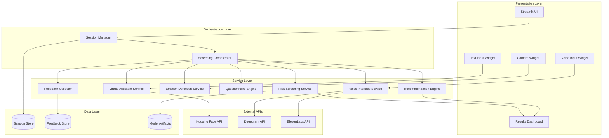
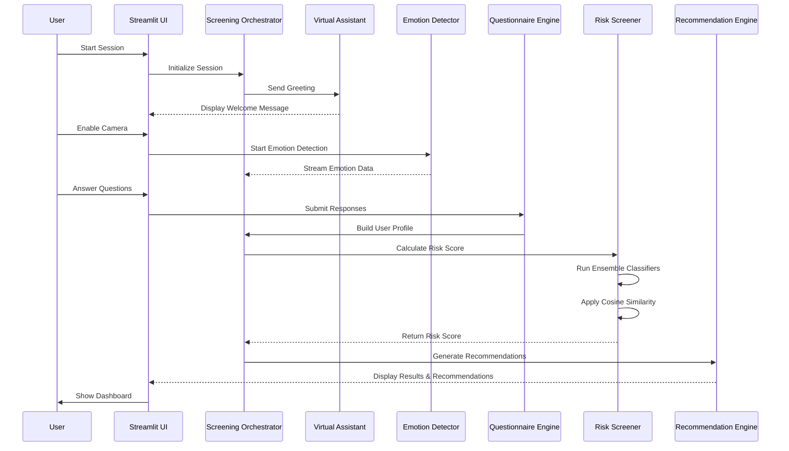

# Design Document: Mental Health Assistant

## Overview

The Mental Health Assistant is a multi-modal screening application built on Streamlit that integrates conversational AI, computer vision, and machine learning to provide accessible mental health risk assessment. The system architecture follows a modular design with clear separation between the presentation layer (Streamlit UI), business logic layer (screening orchestration), and service layer (AI/ML models and external APIs).

The application supports three primary interaction modes:
1. **Text-based conversation** with an AI assistant powered by Llama-2-7b-chat-hf
2. **Voice interaction** using speech-to-text (Deepgram) and text-to-speech (ElevenLabs)
3. **Visual emotion detection** using computer vision (Haar Cascade + CNN)

All three modalities feed into a unified risk assessment pipeline that combines questionnaire responses, detected emotions, and conversational context to generate a comprehensive mental health risk score.

## Architecture

### High-Level Architecture



### Component Interaction Flow



## Components and Interfaces

### 1. Session Manager

**Responsibility:** Manages user session lifecycle, state persistence, and session-scoped data.

**Interface:**
```python
class SessionManager:
    def create_session() -> SessionID
    def get_session(session_id: SessionID) -> Session
    def update_session(session_id: SessionID, data: dict) -> None
    def end_session(session_id: SessionID) -> None
    def anonymize_session(session_id: SessionID) -> AnonymousSessionID
```

**Key Behaviors:**
- Generates unique session identifiers
- Maintains session state in Streamlit session_state
- Handles session timeout (30 minutes of inactivity)
- Anonymizes session data before persistence

### 2. Virtual Assistant Service

**Responsibility:** Manages conversational AI interactions using Llama-2-7b-chat-hf and Langchain for context management.

**Interface:**
```python
class VirtualAssistantService:
    def __init__(self, hf_api_key: str)
    def send_message(session_id: SessionID, message: str) -> AssistantResponse
    def get_conversation_history(session_id: SessionID) -> List[Message]
    def clear_context(session_id: SessionID) -> None
```

**Key Behaviors:**
- Maintains conversation history using Langchain's ConversationBufferMemory
- Compresses context after 50 exchanges using ConversationSummaryMemory
- Implements retry logic with exponential backoff for API failures
- Enforces 5-second response timeout
- Uses system prompts to prevent medical diagnosis claims

### 3. Voice Interface Service

**Responsibility:** Handles speech-to-text and text-to-speech conversion with audio playback.

**Interface:**
```python
class VoiceInterfaceService:
    def __init__(self, deepgram_key: str, elevenlabs_key: str)
    def transcribe_audio(audio_data: bytes) -> TranscriptionResult
    def synthesize_speech(text: str, voice_id: str) -> AudioData
    def play_audio(audio_data: AudioData) -> None
    def stop_playback() -> None
```

**Key Behaviors:**
- Captures audio from microphone using sounddevice library
- Sends audio to Deepgram API for transcription
- Handles transcription confidence scores (threshold: 0.7)
- Synthesizes speech using ElevenLabs with configurable voice profiles
- Uses Pygame Mixer for audio playback with volume control

### 4. Emotion Detection Service

**Responsibility:** Performs real-time facial emotion detection using computer vision.

**Interface:**
```python
class EmotionDetectionService:
    def __init__(self, model_path: str)
    def detect_faces(frame: np.ndarray) -> List[FaceRegion]
    def extract_features(face_region: np.ndarray) -> FeatureVector
    def classify_emotion(features: FeatureVector) -> EmotionPrediction
    def process_frame(frame: np.ndarray) -> List[EmotionPrediction]
```

**Key Behaviors:**
- Uses Haar Cascade Classifier for face detection (OpenCV)
- Extracts HOG features from detected face regions
- Normalizes images to 48x48 grayscale
- Classifies emotions using pre-trained CNN (7 classes: happy, sad, angry, fear, surprise, disgust, neutral)
- Returns emotion labels with confidence scores
- Processes frames at 5+ FPS

**CNN Architecture:**
```
Input (48x48x1) 
→ Conv2D(32, 3x3) + ReLU + BatchNorm 
→ Conv2D(64, 3x3) + ReLU + BatchNorm 
→ MaxPool(2x2)
→ Conv2D(128, 3x3) + ReLU + BatchNorm
→ MaxPool(2x2)
→ Flatten
→ Dense(256) + ReLU + Dropout(0.5)
→ Dense(7) + Softmax
```

### 5. Questionnaire Engine

**Responsibility:** Manages screening questionnaire presentation and response collection.

**Interface:**
```python
class QuestionnaireEngine:
    def __init__(self, questionnaire_config: dict)
    def get_next_question(session_id: SessionID) -> Question
    def submit_answer(session_id: SessionID, answer: Answer) -> ValidationResult
    def is_complete(session_id: SessionID) -> bool
    def build_user_profile(session_id: SessionID) -> UserProfile
```

**Key Behaviors:**
- Loads questionnaire structure from configuration (JSON/YAML)
- Supports multiple question types: multiple choice, Likert scale (1-5), free text
- Validates answer formats before acceptance
- Tracks progress through questionnaire
- Compiles responses into structured UserProfile

**Question Types:**
- PHQ-9 (depression screening): 9 questions, Likert scale
- GAD-7 (anxiety screening): 7 questions, Likert scale
- Custom questions: demographic, stressors, support system

### 6. Risk Screening Service

**Responsibility:** Calculates mental health risk scores using ensemble ML classifiers.

**Interface:**
```python
class RiskScreeningService:
    def __init__(self, model_artifacts_path: str)
    def calculate_risk_score(user_profile: UserProfile, emotions: List[EmotionPrediction]) -> RiskScore
    def get_risk_factors(user_profile: UserProfile) -> List[RiskFactor]
    def train_models(training_data: pd.DataFrame) -> ModelMetrics
    def tune_hyperparameters(training_data: pd.DataFrame) -> BestParams
```

**Key Behaviors:**
- Loads pre-trained ensemble models: Adaboost, GBM, Random Forest, SVM, Decision Tree
- Aggregates predictions using Logistic Regression meta-classifier
- Calculates cosine similarity between user responses and known risk profiles
- Incorporates emotion detection scores (weighted average of detected emotions)
- Outputs Risk_Score in range [0.0, 1.0]
- Identifies specific risk factors (e.g., suicidal ideation, severe anxiety)

**Feature Engineering:**
- Questionnaire responses: normalized Likert scores
- Emotion scores: frequency and intensity of negative emotions
- Interaction patterns: response time, conversation sentiment
- Combined feature vector: 50-100 dimensions

**Ensemble Weighting:**
```
Final_Score = 0.3 * Questionnaire_Score 
            + 0.2 * Emotion_Score 
            + 0.5 * Ensemble_Classifier_Score
```

### 7. Recommendation Engine

**Responsibility:** Generates personalized recommendations based on risk assessment.

**Interface:**
```python
class RecommendationEngine:
    def __init__(self, resources_db: dict)
    def generate_recommendations(risk_score: RiskScore, risk_factors: List[RiskFactor]) -> Recommendations
    def get_crisis_resources() -> CrisisResources
    def get_self_help_plans(risk_factors: List[RiskFactor]) -> List[SelfHelpPlan]
```

**Key Behaviors:**
- Applies risk threshold (0.7) to determine recommendation type
- For high risk (>0.7): suggests professional resources, therapy options, crisis hotlines
- For critical risk (>0.85): prominently displays crisis hotline (988 in US)
- For moderate risk (0.4-0.7): provides self-help resources, coping strategies
- For low risk (<0.4): offers wellness tips, preventive strategies
- Personalizes recommendations based on identified risk factors
- Uses non-stigmatizing, supportive language

### 8. Feedback Collector

**Responsibility:** Collects and stores user feedback for model improvement.

**Interface:**
```python
class FeedbackCollector:
    def __init__(self, feedback_store: FeedbackStore)
    def prompt_feedback(session_id: SessionID) -> None
    def submit_feedback(session_id: SessionID, feedback: Feedback) -> None
    def get_feedback_for_training() -> pd.DataFrame
    def run_ab_test(model_a: Model, model_b: Model) -> ABTestResults
```

**Key Behaviors:**
- Prompts users for feedback after screening completion
- Collects structured feedback: accuracy rating (1-5), helpfulness rating (1-5)
- Collects unstructured feedback: free-text comments
- Anonymizes feedback before storage
- Enables A/B testing of classification models
- Exports feedback data for model retraining

## Data Models

### Session
```python
@dataclass
class Session:
    session_id: str
    created_at: datetime
    last_activity: datetime
    conversation_history: List[Message]
    questionnaire_progress: dict
    emotion_data: List[EmotionPrediction]
    risk_score: Optional[float]
    status: SessionStatus  # ACTIVE, COMPLETED, EXPIRED
```

### Message
```python
@dataclass
class Message:
    role: str  # "user" or "assistant"
    content: str
    timestamp: datetime
    metadata: dict  # e.g., {"source": "voice", "confidence": 0.95}
```

### UserProfile
```python
@dataclass
class UserProfile:
    questionnaire_responses: dict  # question_id -> answer
    phq9_score: int  # 0-27
    gad7_score: int  # 0-21
    demographic_data: dict
    response_times: List[float]
```

### EmotionPrediction
```python
@dataclass
class EmotionPrediction:
    emotion: str  # happy, sad, angry, fear, surprise, disgust, neutral
    confidence: float  # 0.0-1.0
    timestamp: datetime
    face_region: Tuple[int, int, int, int]  # x, y, width, height
```

### RiskScore
```python
@dataclass
class RiskScore:
    overall_score: float  # 0.0-1.0
    questionnaire_component: float
    emotion_component: float
    classifier_component: float
    risk_factors: List[RiskFactor]
    confidence_interval: Tuple[float, float]
```

### RiskFactor
```python
@dataclass
class RiskFactor:
    factor_type: str  # e.g., "suicidal_ideation", "severe_anxiety"
    severity: str  # LOW, MODERATE, HIGH, CRITICAL
    evidence: List[str]  # supporting evidence from responses
```

### Recommendations
```python
@dataclass
class Recommendations:
    recommendation_type: str  # PROFESSIONAL_HELP, SELF_HELP, WELLNESS
    primary_message: str
    resources: List[Resource]
    crisis_info: Optional[CrisisResources]
    self_help_plans: List[SelfHelpPlan]
```

### Feedback
```python
@dataclass
class Feedback:
    session_id: str
    accuracy_rating: int  # 1-5
    helpfulness_rating: int  # 1-5
    comments: str
    would_recommend: bool
    timestamp: datetime
```

## Correctness Properties

*A property is a characteristic or behavior that should hold true across all valid executions of a system—essentially, a formal statement about what the system should do. Properties serve as the bridge between human-readable specifications and machine-verifiable correctness guarantees.*


### Property Reflection

After analyzing all acceptance criteria, I've identified several areas where properties can be consolidated:

**Consolidation Opportunities:**
1. Properties 6.1 and 6.2 (high-risk vs low-risk recommendations) can be combined into a single property about threshold-based recommendation routing
2. Properties 4.2 and 4.5 (answer validation and optional question handling) are both about input validation and can be combined
3. Properties 10.1 and 10.3 (PII storage and anonymization) both address privacy and can be unified
4. Properties 11.2 and 11.3 (camera and voice fallback) are both graceful degradation patterns and can be combined
5. Properties 12.2 and 12.3 (context retrieval and compression) are both about context management and can be unified

**Unique Value Properties:**
- Response time constraints (1.2)
- Context preservation across conversations (1.3)
- Risk score bounds (5.6)
- Crisis resource inclusion (6.3)
- Feedback storage with session association (7.2)
- Error logging (11.5)
- Session isolation (12.4, 12.5)

### Correctness Properties

**Property 1: Response Time Constraint**
*For any* user message sent to the Virtual Assistant, the system should generate and return a response within 5 seconds.
**Validates: Requirements 1.2**

**Property 2: Context Preservation Across Conversations**
*For any* conversation exceeding 10 exchanges, when a user references information from a previous message, the Virtual Assistant's response should demonstrate awareness of that prior context.
**Validates: Requirements 1.3**

**Property 3: Medical Diagnosis Prohibition**
*For any* response generated by the Virtual Assistant, the text should not contain medical diagnosis language (phrases like "you have", "you are diagnosed with", "you suffer from" followed by condition names).
**Validates: Requirements 1.4**

**Property 4: Voice Transcription Round-Trip**
*For any* audio input provided to the Voice Interface, the system should produce a text transcription, and low-confidence transcriptions (confidence < 0.7) should trigger a retry prompt.
**Validates: Requirements 2.1, 2.4**

**Property 5: Text-to-Speech Conversion**
*For any* text response from the Virtual Assistant, when voice mode is enabled, the Voice Interface should produce corresponding audio data.
**Validates: Requirements 2.2**

**Property 6: Face Detection in Frames**
*For any* video frame containing a human face, the Emotion Detector should identify at least one face region with bounding box coordinates.
**Validates: Requirements 3.1**

**Property 7: Image Preprocessing Consistency**
*For any* detected face region, the preprocessing pipeline should output a grayscale image normalized to 48x48 pixels with pixel values in range [0, 1].
**Validates: Requirements 3.3**

**Property 8: Emotion Classification Output Format**
*For any* emotion classification result, the output should contain an emotion label (one of: happy, sad, angry, fear, surprise, disgust, neutral) and a confidence score in range [0.0, 1.0].
**Validates: Requirements 3.5**

**Property 9: Questionnaire Sequence Consistency**
*For any* questionnaire session, questions should be presented in the same configured order across all sessions.
**Validates: Requirements 4.1**

**Property 10: Answer Validation and Optional Handling**
*For any* answer submission, invalid formats should be rejected with an error message, and skipping optional questions should not prevent questionnaire progression.
**Validates: Requirements 4.2, 4.5**

**Property 11: UserProfile Compilation**
*For any* completed questionnaire (all required questions answered), the Questionnaire Engine should produce a valid UserProfile containing all submitted responses and calculated PHQ-9 and GAD-7 scores.
**Validates: Requirements 4.3**

**Property 12: Multi-Type Question Support**
*For any* question type (multiple choice, Likert scale, free text), the Questionnaire Engine should correctly validate and store answers of that type.
**Validates: Requirements 4.4**

**Property 13: Risk Score Generation**
*For any* complete UserProfile, the Risk Screener should calculate and return a RiskScore object.
**Validates: Requirements 5.1**

**Property 14: Emotion Data Incorporation**
*For any* two identical UserProfiles where one includes emotion detection data and the other doesn't, the Risk Scores should differ, demonstrating that emotion data influences the calculation.
**Validates: Requirements 5.5**

**Property 15: Risk Score Bounds**
*For any* risk score calculation, the overall_score field should be in the range [0.0, 1.0] inclusive.
**Validates: Requirements 5.6**

**Property 16: Threshold-Based Recommendation Routing**
*For any* RiskScore, if overall_score > 0.7, recommendations should include professional help resources; if overall_score ≤ 0.7, recommendations should include self-help plans.
**Validates: Requirements 6.1, 6.2**

**Property 17: Crisis Resource Inclusion**
*For any* RiskScore where overall_score > 0.85, the generated Recommendations should include crisis hotline information in the crisis_info field.
**Validates: Requirements 6.3**

**Property 18: Risk Factor Personalization**
*For any* Recommendations object, the resources and self_help_plans should reference at least one of the identified risk factors from the RiskScore.
**Validates: Requirements 6.4**

**Property 19: Feedback Storage with Session Association**
*For any* submitted Feedback, retrieving feedback data should return the feedback with correct session_id association, enabling traceability to the original screening session.
**Validates: Requirements 7.2**

**Property 20: Multi-Format Feedback Support**
*For any* Feedback submission, the system should accept and store both structured data (accuracy_rating, helpfulness_rating) and unstructured data (comments text).
**Validates: Requirements 7.3**

**Property 21: Feedback Anonymization**
*For any* stored Feedback record, the data should not contain personally identifiable information (email, name, IP address, device identifiers).
**Validates: Requirements 7.5**

**Property 22: Model Evaluation Metrics Completeness**
*For any* model evaluation run, the output should include precision, recall, and F1-score metrics for all evaluated classes.
**Validates: Requirements 8.3**

**Property 23: Dataset Separation**
*For any* model training run, the training, validation, and test datasets should have no overlapping samples (intersection of sample IDs should be empty).
**Validates: Requirements 8.4**

**Property 24: Privacy-Preserving Data Storage**
*For any* session without explicit user consent, stored session data should not contain PII, and all stored sessions should use anonymized identifiers.
**Validates: Requirements 10.1, 10.3**

**Property 25: Data Deletion Completeness**
*For any* data deletion request with a session_id, after processing the request, querying for that session_id should return no results.
**Validates: Requirements 10.5**

**Property 26: API Retry with Exponential Backoff**
*For any* failed API call (Hugging Face, Deepgram, ElevenLabs), the system should retry up to 3 times with exponentially increasing delays (e.g., 1s, 2s, 4s) before returning an error.
**Validates: Requirements 11.1**

**Property 27: Graceful Degradation for Optional Services**
*For any* session where camera or voice services are unavailable, the screening should complete successfully using available modalities (text-only if needed).
**Validates: Requirements 11.2, 11.3**

**Property 28: Model Failure Error Handling**
*For any* Risk Screener failure during score calculation, the system should return an error message suggesting retry or direct professional consultation, rather than crashing.
**Validates: Requirements 11.4**

**Property 29: Error Logging Completeness**
*For any* error or exception, the system should log an entry containing timestamp, error type, error message, and stack trace.
**Validates: Requirements 11.5**

**Property 30: Context Management and Compression**
*For any* conversation session, context should be retrievable when referenced, and sessions exceeding 50 exchanges should trigger context summarization to maintain performance.
**Validates: Requirements 12.2, 12.3**

**Property 31: Session Initialization Isolation**
*For any* newly created session, the conversation context should be empty (no messages from previous sessions).
**Validates: Requirements 12.4**

**Property 32: Session Context Isolation**
*For any* two different sessions, context from one session should never appear in the conversation history of the other session.
**Validates: Requirements 12.5**

## Error Handling

### Error Categories and Strategies

**1. External API Failures**
- **Hugging Face API**: Retry with exponential backoff (3 attempts), fallback to cached responses for common queries, display user-friendly error message
- **Deepgram API**: Retry transcription, prompt user to repeat, offer text input fallback
- **ElevenLabs API**: Retry synthesis, fallback to text-only display if synthesis fails repeatedly
- **Strategy**: Circuit breaker pattern to prevent cascading failures

**2. Model Inference Errors**
- **CNN Emotion Detection**: Log error, continue screening without emotion data, mark emotion_component as unavailable
- **Risk Classifier Ensemble**: If individual classifier fails, use remaining classifiers; if all fail, notify user and suggest professional consultation
- **Strategy**: Partial failure tolerance with graceful degradation

**3. Data Validation Errors**
- **Invalid Questionnaire Answers**: Display inline validation error, highlight problematic field, provide format examples
- **Malformed User Input**: Sanitize input, reject with clear error message, log suspicious patterns
- **Strategy**: Fail-fast validation with helpful error messages

**4. Resource Unavailability**
- **Camera Access Denied**: Display permission request, offer to continue without emotion detection
- **Microphone Access Denied**: Display permission request, offer text-only mode
- **Strategy**: Progressive enhancement - core functionality works without optional features

**5. Session Management Errors**
- **Session Timeout**: Save partial progress, offer to resume or restart
- **Concurrent Session Conflicts**: Use session locking, display "session in use" message
- **Strategy**: Optimistic locking with conflict resolution

**6. Data Storage Errors**
- **Database Write Failures**: Retry with exponential backoff, queue for later persistence, notify user of temporary issue
- **Storage Quota Exceeded**: Archive old sessions, implement data retention policy
- **Strategy**: Write-ahead logging with retry queue

### Error Response Format

All errors should follow a consistent structure:
```python
@dataclass
class ErrorResponse:
    error_code: str  # e.g., "API_TIMEOUT", "VALIDATION_ERROR"
    user_message: str  # User-friendly explanation
    technical_details: str  # For logging/debugging
    suggested_action: str  # What user should do next
    timestamp: datetime
    session_id: Optional[str]
```

### Logging Strategy

- **ERROR level**: API failures, model inference errors, data corruption
- **WARN level**: Retry attempts, degraded functionality, validation failures
- **INFO level**: Session lifecycle events, successful API calls, user actions
- **DEBUG level**: Detailed request/response data, intermediate calculations

All logs should include session_id for traceability and exclude PII.

## Testing Strategy

### Dual Testing Approach

The Mental Health Assistant requires both unit testing and property-based testing to ensure correctness and reliability. These approaches are complementary:

- **Unit tests** verify specific examples, edge cases, and integration points
- **Property tests** verify universal properties across all inputs through randomization

### Unit Testing Focus Areas

**1. Specific Examples**
- Session initialization produces expected greeting message
- PHQ-9 score calculation for known response patterns
- Emotion classification for sample facial images
- Risk threshold boundary cases (scores at exactly 0.7, 0.85)

**2. Integration Points**
- Virtual Assistant → Hugging Face API integration
- Voice Interface → Deepgram/ElevenLabs integration
- Emotion Detector → CNN model loading and inference
- Risk Screener → ensemble model coordination

**3. Edge Cases and Error Conditions**
- Empty questionnaire responses
- Malformed API responses
- Camera/microphone permission denials
- Network timeouts and retries
- Session expiration during active screening

**4. Privacy and Security**
- PII detection and anonymization
- Session data isolation
- Consent verification before data storage

### Property-Based Testing Configuration

**Testing Library**: Use `hypothesis` for Python-based property testing

**Test Configuration**:
- Minimum 100 iterations per property test (due to randomization)
- Each test tagged with: `# Feature: mental-health-assistant, Property {N}: {property_text}`
- Seed randomization for reproducibility in CI/CD

**Property Test Implementation Guidelines**:

1. **Property 1-3 (Virtual Assistant)**
   - Generate random user messages of varying lengths
   - Measure response times across message types
   - Test context preservation with conversation chains
   - Verify absence of diagnosis language in all responses

2. **Property 6-8 (Emotion Detection)**
   - Generate synthetic face images with known emotions
   - Test preprocessing pipeline with various image sizes/formats
   - Verify output format consistency across all inputs

3. **Property 9-12 (Questionnaire)**
   - Generate random questionnaire configurations
   - Test with valid and invalid answer formats
   - Verify UserProfile compilation for all completion paths

4. **Property 13-15 (Risk Scoring)**
   - Generate random UserProfiles with varying risk levels
   - Test with and without emotion data
   - Verify score bounds across all inputs

5. **Property 16-18 (Recommendations)**
   - Generate RiskScores across full range [0.0, 1.0]
   - Verify threshold-based routing for all scores
   - Test crisis resource inclusion at boundary (0.85)

6. **Property 19-21 (Feedback)**
   - Generate random feedback submissions
   - Verify storage and retrieval round-trip
   - Test anonymization with various PII patterns

7. **Property 24-25 (Privacy)**
   - Generate sessions with and without consent
   - Test PII detection across various formats
   - Verify deletion completeness

8. **Property 26-29 (Error Handling)**
   - Simulate API failures with random timing
   - Test retry logic with exponential backoff
   - Verify error logging completeness

9. **Property 30-32 (Context Management)**
   - Generate conversation chains of varying lengths
   - Test context compression at 50+ exchanges
   - Verify session isolation with concurrent sessions

### Test Coverage Goals

- **Line Coverage**: Minimum 80% for all service modules
- **Branch Coverage**: Minimum 75% for conditional logic
- **Property Coverage**: 100% of design properties implemented as tests
- **Integration Coverage**: All external API integrations tested with mocks

### Continuous Testing

- Run unit tests on every commit
- Run property tests (100 iterations) on every PR
- Run extended property tests (1000 iterations) nightly
- Run integration tests against staging APIs weekly
- Monitor test execution time (unit tests < 2 minutes, property tests < 10 minutes)

### Test Data Management

- Use synthetic data for emotion detection (generated faces, not real user photos)
- Use anonymized questionnaire responses for risk scoring tests
- Mock all external API responses for deterministic testing
- Maintain separate test databases for feedback and session storage
- Clear test data after each test run to prevent contamination
